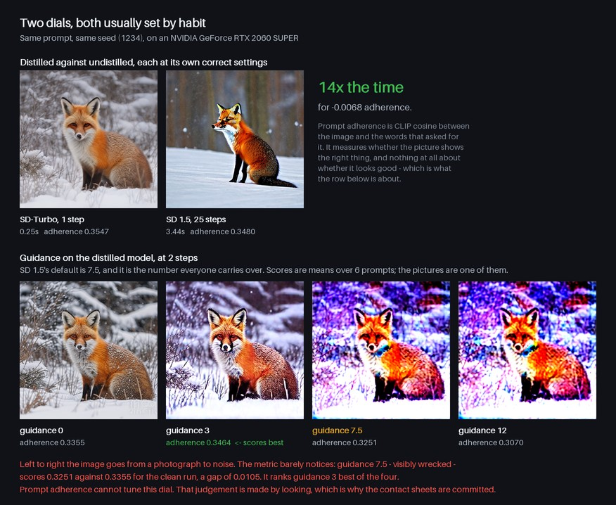

# image-generation

Text-to-image and image-to-image with pretrained Stable Diffusion — no fine-tuning, no LoRAs.
The repository is really about the two dials everybody turns without measuring, **steps** and
**guidance**, and about what happens when you try to tune them with an automatic metric.

```
   prompt ──▶ text encoder ──▶ ┌──────────────┐ ──▶ VAE decode ──▶ image
                               │  UNet × steps │
   seed  ────────────────────▶ └──────────────┘
                                  ▲
                    guidance ─────┘   runs the UNet a second time, unconditionally
```



*Generated by `scripts/make_figures.py`, which re-measures both claims before drawing them and
refuses to ship a caption its own numbers contradict.*

Two models, because the right settings for one are wrong for the other by an order of magnitude:

| | model | steps | guidance | 512×512 |
|---|---|---:|---:|---:|
| **turbo** | `stabilityai/sd-turbo`, adversarially distilled | 1–4 | 0 | **0.23 s** |
| **base** | `stable-diffusion-v1-5`, undistilled | 16–40 | 7.5 | 3.39 s |

---

## More steps is not better

Six prompts × two seeds per configuration, measured on an RTX 2060 SUPER. Prompt adherence is
CLIP cosine between the image and the words that asked for it.

**SD-Turbo** — adherence is *highest at one step* and falls from there:

| steps | adherence | vs best | s/image | vs fastest |
|---:|---:|---:|---:|---:|
| **1** | **0.3379** | +0.0000 | **0.23** | 1.0× |
| 2 | 0.3371 | −0.0008 | 0.30 | 1.3× |
| 4 | 0.3328 | −0.0051 | 0.44 | 1.9× |
| 8 | 0.3270 | −0.0109 | 0.72 | 3.1× |

Three times the compute for a *worse* result. The contact sheet shows why: by 8 steps the
astronaut has lost his horse. A model distilled to finish in one step keeps travelling when you
give it a longer schedule, and it travels away from the prompt.

**Stable Diffusion 1.5** — the same question, the opposite answer:

| steps | adherence | vs best | s/image | vs fastest |
|---:|---:|---:|---:|---:|
| 4 | 0.2848 | −0.0515 | 0.76 | 1.0× |
| 8 | 0.3095 | −0.0268 | 1.24 | 1.6× |
| **16** | 0.3347 | −0.0016 | **2.23** | 2.9× |
| 25 | 0.3339 | −0.0024 | 3.39 | 4.5× |
| 40 | 0.3363 | +0.0000 | 5.28 | 7.0× |

Undistilled, it genuinely needs the steps — and then stops needing them at 16. Going 16 → 40
costs 2.4× the time for +0.0016.

**Headline.** SD-Turbo at one step scores 0.3379 in 0.23 s. SD 1.5 at its conventional 25 steps
scores 0.3339 in 3.39 s. **15× the time, for −0.0040 adherence.**

---

## Guidance, and the metric that could not see it

Classifier-free guidance is the number carried over by habit. SD 1.5's default is 7.5. Applied
to a distilled model at 2 steps:

| guidance | adherence | vs best | s/image |
|---:|---:|---:|---:|
| 0 | 0.3371 | −0.0060 | 0.33 |
| 1 | 0.3371 | −0.0060 | 0.33 |
| **3** | **0.3431** | **+0.0000** | 0.42 |
| 7.5 | 0.3307 | −0.0124 | 0.42 |
| 12 | 0.3120 | −0.0311 | 0.41 |

Read that table and you would ship guidance 3, and you would conclude that 7.5 is nearly as good
as 0 — a difference of 0.006, smaller than the gap between 1 and 8 steps.

Then open [the contact sheet](data/reports/sheets/guidance_turbo.jpg):

```
guidance 0      clean
guidance 1      pixel-identical to 0   (diffusers skips CFG at ≤ 1)
guidance 3      highlights blowing out, snow going flat
guidance 7.5    posterised, magenta and blue banding
guidance 12     psychedelic wreckage
```

**The score ranks these almost exactly wrong.** It puts the washed-out run first and rates
visibly destroyed images within 0.006 of the clean ones. CLIP adherence measures whether the
picture shows a fox in snow; all of them do, including the ones that look like a broken
television.

This is the most useful thing in the repository, and it is a result *against* its own
instrumentation: **a prompt-adherence metric cannot tune guidance.** The number in
[src/engine.py](src/engine.py) that warns you off guidance on a distilled model is justified by
looking at pictures, and the docstring says so — the first draft of that function asserted the
metric would back it up, and the measurement said otherwise.

Guidance also costs 1.3×, not the 2× you would expect from running the UNet twice: at two steps,
text encoding and VAE decode dominate the wall clock.

Reproduce all three sweeps: `python scripts/benchmark.py`

---

## Quick start

```bash
git clone https://github.com/yelaman1x9/image-generation.git
cd image-generation

# CPU works but takes minutes per image; use the gpu profile if you have the card.
docker compose --profile gpu build web-gpu
docker compose --profile gpu up web-gpu        # http://localhost:8000
```

Weights are baked into the image at build time, so the container needs no network at runtime.

Reproduce the tables and the contact sheets (about six minutes on a 2060 SUPER):

```bash
docker compose run --rm --entrypoint python web-gpu scripts/benchmark.py
```

---

## The app

**Generate** — prompt, model, steps, guidance, seed, optional starting image. Defaults follow
the model rather than a global habit, and the warnings from `engine.advice()` appear as you move
the dials rather than after the image has been paid for.

**Compare models** — same prompt, same seed, both models each at its own correct settings. Not a
fair fight on step count; that is the point.

**Sweep a dial** — hold everything still and move one thing. Run *guidance* on turbo and watch
the table disagree with your eyes.

**Findings** — the committed benchmark, rendered from `data/reports/benchmark.json`, with the
contact sheet underneath it.

---

## CLI

```bash
python src/cli.py "a red fox in fresh snow"
python src/cli.py "a red fox in fresh snow" --model base --steps 30
python src/cli.py "make it winter" --init photo.jpg --strength 0.55
python src/cli.py "a lighthouse in a storm" --sweep guidance
python src/cli.py info
```

## HTTP API

Interactive docs at `/api/docs`.

| Endpoint | Purpose |
|---|---|
| `GET /api/config` | Models, defaults, ladders, the committed benchmark. |
| `POST /api/generate` | One image. `init` switches to image-to-image. |
| `POST /api/compare` | Both models, one prompt, one seed. |
| `POST /api/sweep` | One dial, everything else fixed. |
| `GET /api/outputs/{name}` | Serve a generated image. |

The GPU is serialised behind a single lock rather than a job queue: at turbo step counts a
request finishes in well under a second, and a polling protocol would add more latency than it
removes.

---

## Implementation notes worth knowing

- **`from_pipe` shares weights.** The text-to-image and image-to-image pipelines are the same
  modules with a different scheduler loop, so having both costs one copy of the model. Only one
  *model* stays resident: SD-Turbo and SD 1.5 together leave too little of an 8 GB card for
  activations, so switching models reloads. A few seconds beats an out-of-memory error.
- **Image-to-image runs `steps × strength` steps, not `steps`.** Diffusers rounds that down, and
  at turbo step counts it can round to zero — which returns your input image untouched and looks
  exactly like a bug. `engine.generate` raises the count instead.
- **A negative prompt does nothing without guidance.** It is realised *through* classifier-free
  guidance, so at guidance 0 it is not merely weak, it is unused. The app says so rather than
  silently ignoring it.
- **Guidance ≤ 1 is skipped entirely**, which is why 0 and 1 produce pixel-identical images and
  identical timings above.
- Peak VRAM is 3.2–3.9 GB at 512×512 in fp16, measured with `torch.cuda.max_memory_allocated`.

---

## Limitations

- **The NSFW safety checker is off by default.** It costs ~1.2 GB of an 8 GB card and fires on
  plenty of innocuous images, and a black square instead of a lighthouse makes a poor
  demonstration. That trade is defensible for a local research tool and is *not* defensible for
  anything public — set `SAFETY_CHECKER=1` before exposing this to other people.
- **Everything it produces is synthetic** and should be labelled as such. Do not use it to
  depict real, identifiable people, and do not present its output as a photograph of anything
  that happened.
- **CLIP adherence is not quality.** Demonstrated above at some length. It also cannot see
  anatomy, text rendering, or composition, and it shares CLIP's own biases about what words mean.
- Adherence differences under about 0.005 are inside the noise of six prompts and two seeds;
  the step ladders are separated by more than that, the top of the guidance table is not.
- Fixed at 512×512. SD 1.5 and SD-Turbo both degrade away from their training resolution, and
  SDXL-Turbo would be the answer at 1024 — on a card with more than 8 GB.
- Timings are one machine. Ratios travel; seconds do not.

## Licence

MIT — see [LICENSE](LICENSE). The model weights are released under the CreativeML Open RAIL-M
licence, which carries use restrictions of its own.
